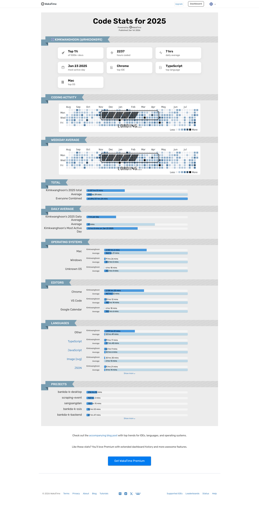

<div align="center">
 
# Hi, I'm KwangHoon Kim 👋
 
**Web Engineer** · Seoul, Korea 🇰🇷
 
<p>
  <a href="https://wakatime.com/@rhkdgns95">
    
  </a>
  
  
</p>
 
</div>
 
---
 
## About me
 
TypeScript와 React를 주로 사용하는 Web 엔지니어입니다.  
 
- 🌱 Bun, Opencode, GSD, GSD-2
- 💬 rhkdgns9489@gmail.com
 
---
 
## Tech Stack
 


<br />


 
---
 
## This Week I Coded
 
<!--START_SECTION:waka-->

```txt
From: 20 March 2026 - To: 27 March 2026

Total Time: 57 hrs 22 mins

Other        46 hrs 16 mins        ⣿⣿⣿⣿⣿⣿⣿⣿⣿⣿⣿⣿⣿⣿⣿⣿⣿⣿⣿⣿⣄⣀⣀⣀⣀   80.66 %
TypeScript   6 hrs 5 mins          ⣿⣿⣶⣀⣀⣀⣀⣀⣀⣀⣀⣀⣀⣀⣀⣀⣀⣀⣀⣀⣀⣀⣀⣀⣀   10.62 %
Markdown     2 hrs 55 mins         ⣿⣤⣀⣀⣀⣀⣀⣀⣀⣀⣀⣀⣀⣀⣀⣀⣀⣀⣀⣀⣀⣀⣀⣀⣀   05.09 %
Kotlin       1 hr 13 mins          ⣦⣀⣀⣀⣀⣀⣀⣀⣀⣀⣀⣀⣀⣀⣀⣀⣀⣀⣀⣀⣀⣀⣀⣀⣀   02.13 %
Text         22 mins               ⣄⣀⣀⣀⣀⣀⣀⣀⣀⣀⣀⣀⣀⣀⣀⣀⣀⣀⣀⣀⣀⣀⣀⣀⣀   00.67 %
Groovy       13 mins               ⣄⣀⣀⣀⣀⣀⣀⣀⣀⣀⣀⣀⣀⣀⣀⣀⣀⣀⣀⣀⣀⣀⣀⣀⣀   00.39 %
```

<!--END_SECTION:waka-->
 
---
 
## Stats

<div align="center">
 
 
</div>

<div align="center">
 
</div>

<div align="center">
 
</div>

<div align="center">
 
</div>

---

<div align="center">
 <sub>📊 자동 업데이트 · WakaTime + GitHub Actions</sub>
</div>
